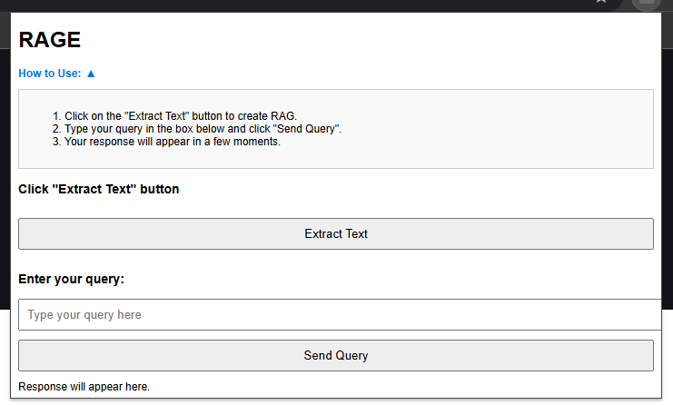

# RAGE: Chrome Extension with Backend for Text Extraction and Query Processing using RAG

This project is a Chrome extension integrated with a FastAPI backend for extracting text from web pages and processing user queries using retrieval-augmented generation (RAG). The extension extracts visible text and submits queries, which are processed by the backend. NVIDIA's LLMs are utilized to generate responses, while ChromaDB enables efficient storage and retrieval of embeddings.




## Repository Structure

```
├── Backend 
    │ └── main.py # FastAPI server to handle text processing and query requests 
├── Extension 
    │ ├── libs # Contains libraries such as marked.js for rendering Markdown in popup 
    │ ├── background.js # Background script for handling messages and backend communication 
    │ ├── content.js # Content script for extracting visible text from the webpage 
    │ ├── manifest.json # Manifest file for Chrome extension configuration 
    │ ├── popup.html # HTML file for the extension's popup interface 
    │ └── popup.js # JavaScript for popup UI interactions and backend requests     
└── requirements.txt # Python dependencies for the backend
```

## Features

- **Text Extraction**: Extract visible text from any webpage and display it in the Chrome extension popup. 
- **Backend Query Processing**: Send extracted text to a FastAPI backend that processes the text and stores embeddings using ChromaDB. 
- **User Query Handling**: Allows users to ask questions in the popup, with backend responses generated using NVIDIA’s large language models.

## Prerequisites

- **Python 3.8+** for running the backend server.
- **Node.js** (optional, for JavaScript development).
- **Google Chrome** (latest version) for using the extension.

## Installation

### 1. Clone the Repository 
```git clone https://github.com/somesh-bagadiya/RAGE-RAG_Extension.git```


```cd RAGE-RAG_Extension```

### 2. Set Up the Backend

#### Step 2.1: Create a Virtual Environment

```python -m venv venv```

#### Step 2.2: Activate the Virtual Environment

 - Windows:
 ``` .\venv\Scripts\activate ```
 - macOS/Linux:
 ``` source venv/bin/activate ```

#### Step 2.3: Install Dependencies
``` pip install -r requirements.txt ```

#### Step 2.4: Set Up NVIDIA API Key
-   Obtain an NVIDIA API key for LLM access.
-   Create a `.env` file in the backend root directory and add your NVIDIA API key:
	``` NVIDIA_API_KEY=your_nvidia_api_key_here ```
	
#### Step 2.5: Update Extension ID in `main.py` 
- After loading the Chrome extension, go to `chrome://extensions/` in your browser to find the extension's ID. 
- Replace the existing ID in `main.py` with your extension's unique ID: 
```allow_origins=["chrome-extension://<your-extension-id>"] # Add your actual extension ID```

### 3. Set Up the Chrome Extension
-   Open Chrome and go to `chrome://extensions/`.
-   Enable **Developer Mode**.
-   Click **Load unpacked** and select the `Extension` folder from this repository.

## Running the Project

### 1. Start the Backend Server

Navigate to the directory where `main.py` is located and run `uvicorn Backend.main:app --reload` 

The FastAPI server should start at [http://127.0.0.1:8000](http://127.0.0.1:8000).

### 2. Use the Chrome Extension

-   Click on the Chrome extension icon in the toolbar to open the popup.
-   **Extract Text**: Click "Extract Text" to retrieve visible text from the current webpage.
-   **Send Query**: Type a query and click "Send Query" to get a response from the backend.


## Project Structure Details

### Backend

-   **main.py**: Main entry point for the FastAPI server. Defines endpoints to handle text processing and query requests.

### Extension

-   **background.js**: Manages background tasks, such as handling messages from `popup.js` and backend communication.
-   **content.js**: Extracts visible text from the webpage and sends it to `popup.js`.
-   **manifest.json**: Configures the Chrome extension, including permissions and scripts.
-   **popup.html**: HTML structure for the Chrome extension popup.
-   **popup.js**: JavaScript for popup interactions, such as sending requests to `background.js` and handling UI elements.


## Example Usage

1.  Navigate to any webpage in Chrome.
2.  Click the extension icon, then click "Extract Text" to retrieve visible text.
3.  Enter a question or query in the input box and click "Send Query".
4.  The extension will display a response in the popup.


## Troubleshooting

-   **Error: NVIDIA API Key Missing**: Ensure that the `.env` file contains your NVIDIA API key.
-   **Extension Not Loading**: Verify that you’ve loaded the `Extension` folder in Chrome’s `chrome://extensions` page.

